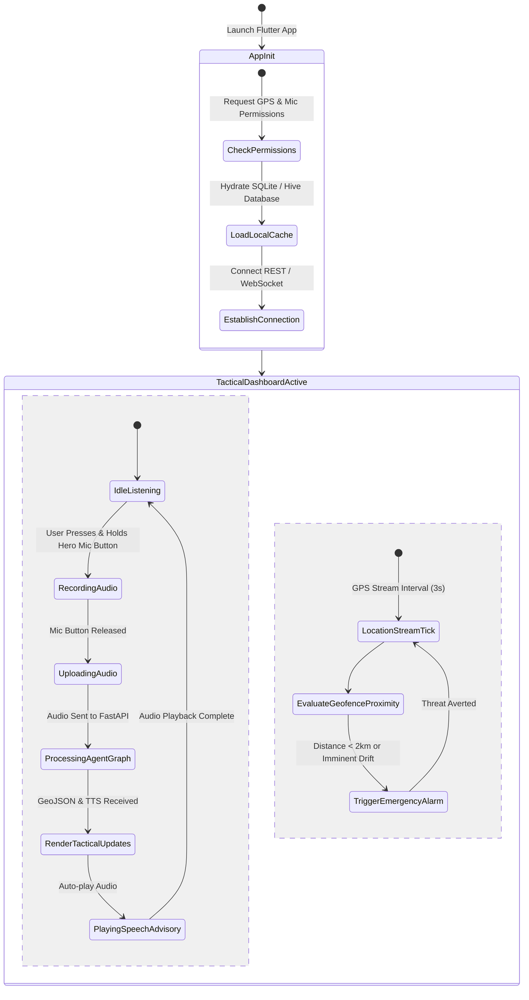
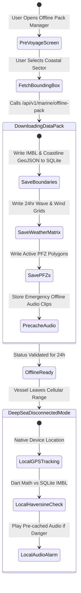

# 🔄 ORCA: Mobile Application & Multi-Agent Flow State Machines
> **Project:** ORCA (Marine EcOsystem Reasoning with Collaborative Agents)  
> **Problem Statement ID:** 26176 | **Document:** Flutter Mobile App & Multi-Agent State Flows  

---

## 1. 🌊 Core Mobile User Journeys

### Journey 1: Voice-First PFZ Discovery & Route Guidance
```text
[Fisherman on Boat]
       │
       ▼ (Holds Native Mobile Mic Button)
"புயல் எச்சரிக்கை உள்ளதா? நல்ல மீன்பிடி பகுதி எங்கே?"
       │
       ▼
[Flutter Audio Recording Stream] ──> Encodes WAV Audio
       │
       ▼
[POST /api/v1/chat/message] (FastAPI Gateway)
       │
       ▼
[Bhashini ASR & NMT Pipeline] ──> Standardized English: "Any storm alert? Where is good PFZ?"
       │
       ▼
[LangGraph Intent Classifier] ──> Inferred: [weather, pfz, routing]
       │
       ├───────────────────────────────┬───────────────────────────────┐
       ▼                               ▼                               ▼
[Weather Agent]                [PFZ Agent]                    [Boundary Agent]
- Wave: 1.3m (Calm)            - Extracts PFZ-04 (14km East)  - IMBL Dist: 8.5km (Safe)
       │                               │                               │
       └───────────────────────────────┼───────────────────────────────┘
                                       │
                                       ▼
                              [Routing Agent (A*)]
                              - Generates collision-free GeoJSON LineString
                                       │
                                       ▼
                       [Deterministic Symbolic Guardrail]
                       - Invariant Checks: Wave < 2.5m, Dist > 5km -> PASS
                                       │
                                       ▼
                         [Response Synthesizer & Bhashini TTS]
                         - Synthesizes Tamil Audio + Advisory text
                                       │
                                       ▼
                         [Flutter Mobile Presentation]
                         - Auto-plays Tamil Voice Advice via AudioPlayer
                         - Renders Cyan Route Line on FlutterMap
                         - Highlights Emerald PFZ-04 Polygon
```

---

### Journey 2: Dynamic IMBL Drift Warning & Evasive Action
```text
[Mobile Phone GPS Telemetry: 9.32°N, 79.45°E | Speed: 14 kts | Heading: 120°]
       │
       ▼ (Mobile Background Stream every 3 seconds)
[Dynamic Geofence Engine / Local Dart GeoMath]
       │
       ├─> Calculates 15-min lookahead vector: Δd = 14 * 1.852 * 0.25 = 6.48 km
       ├─> Detects intersection with IMBL LineString
       └─> Projected boundary breach in 6.8 minutes!
       │
       ▼
[Deterministic Emergency Override]
       │
       ├─> Triggers Heavy Mobile Haptic Vibration (`HapticFeedback.heavyImpact`)
       ├─> Sounds High-Priority Emergency Siren
       ├─> Calculates Immediate Evasive Heading: Bearing (Heading - 120°) = 000° (North)
       └─> Plays Localized Urgent TTS Audio: "எச்சரிக்கை! எல்லை நெருங்குகிறது. உடனே வடக்கு நோக்கி திரும்பவும்!"
       │
       ▼
[Flutter Map Tactical View]
       ├─> Flashes Pulsating Red Warning Cone on Vessel Heading Vector
       └─> Immediately Draws Cyan Escape Course towards Coastal Safety Corridor
```

---

## 2. 📱 Flutter Mobile App State Machine



---

## 3. 💾 Offline Pre-Voyage Storage State Machine


