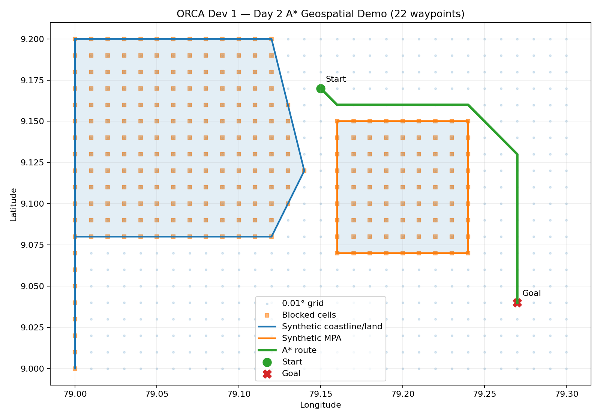

# Geospatial Engine Blueprint & Verification Specification
> **Module Owner:** Dev 1 (Lead Geospatial & Math Engineer)  
> **Source Directory:** `backend/app/geospatial/`  
> **Test Suite:** `backend/tests/test_geospatial.py`  
> **Visual Demo:** `backend/tests/demo_geospatial.py`  

---

## 1. Scope & Capabilities

The ORCA Geospatial Engine provides mathematical and pathfinding foundations for maritime safety and voyage optimization:

- **WGS84 Ellipsoidal Geodesics:** Haversine great-circle distance, geodesic initial true bearing (`pyproj` WGS84 Geod), geodesic forward destination point, and great-circle cross-track offset in `backend/app/geospatial/distance.py`.
- **Local Metric Projections:** Shortest metric distance from any WGS84 coordinate to complex boundary geometries using dynamic Azimuthal Equidistant (`+proj=aeqd`) projections, preventing degree-to-kilometer distortion.
- **Dynamic 15-Minute Lookahead:** Speed and heading forward projection vector (`calculate_lookahead`) calculating prospective boundary intersections and evasive heading in `backend/app/geospatial/geofence.py`.
- **Marine Discretization Grid:** 2D 0.01° (~1.1 km) water grid with 8-directional neighbor exploration and obstacle rasterization in `backend/app/geospatial/grid.py`.
- **A\* Marine Routing:** Obstacle-avoiding pathfinding with octile heuristic producing GeoJSON `LineString` routes in `backend/app/geospatial/astar.py`.
- **GIS Dataset Loader:** GeoPandas layer loader with WGS84 (`EPSG:4326`) normalization in `backend/app/geospatial/shapefile_loader.py`.

---

## 2. Boundary Datasets Specification

Boundary datasets are located in `backend/data/boundaries/`:

```text
backend/data/boundaries/
├── imbl_palk_strait.geojson       # Simplified India-Sri Lanka IMBL segments (Palk Strait & Gulf of Mannar)
├── india_coastline.geojson        # High-resolution coastal polygon boundary
├── india_imbl.geojson             # Full official International Maritime Boundary Line polyline
└── marine_protected_areas.geojson # Restricted Marine Protected Areas (MPAs)
```

> [!NOTE]
> The checked-in files `india_coastline.geojson`, `india_imbl.geojson`, and `marine_protected_areas.geojson` are production placeholders. Active routing and proximity verification currently use `imbl_palk_strait.geojson` which contains real Palk Strait and Gulf of Mannar coordinates.

---

## 3. Installation & Dependencies

Geospatial dependencies are integrated directly into `backend/requirements.txt`:

```bash
cd backend
pip install -r requirements.txt
```

Required packages:
- `shapely>=2.0` (Planar spatial predicates & geometric operations)
- `pyproj>=3.6` (Geodesic forward/inverse ellipsoid math & AEQD projections)
- `geopandas>=1.0` (Vector GIS file I/O and CRS normalization)
- `matplotlib>=3.8` (Visual route plotting & validation)
- `pytest>=8.0` & `pytest-asyncio` (Automated testing)

---

## 4. Automated Testing

Run the geospatial test suite from `backend/`:

```bash
python -m pytest tests/test_geospatial.py -v
```

Expected result: **8 passed** (100%):
1. `test_haversine_one_degree_equator`: Validates ~111 km per degree on equator.
2. `test_bearing_north`: Validates 0° true bearing due north.
3. `test_destination_15_minutes_at_10_knots`: Validates forward geodesic displacement.
4. `test_cross_track_distance`: Validates cross-track calculation.
5. `test_point_in_polygon_is_boundary_inclusive`: Validates `covers` boundary containment.
6. `test_boundary_proximity_uses_km_not_degrees`: Validates AEQD metric projection.
7. `test_lookahead_intersects_boundary`: Validates 15-minute track collision check.
8. `test_grid_rasterization_and_astar_avoids_obstacle`: Validates A* path avoids rasterized land.

---

## 5. Visual Pathfinding Demo

To run the visual A* demonstration:

```bash
# Run from backend directory:
python tests/demo_geospatial.py

# Or headless (for CI):
python tests/demo_geospatial.py --no-show
```

The script:
1. Builds a 0.01° discretized marine grid.
2. Rasterizes synthetic coastline and Marine Protected Area (MPA) obstacles.
3. Solves the lowest-cost A* route between start and goal coordinates.
4. Saves visualization chart to `docs/geospatial_demo.png`.
5. Exports route GeoJSON Feature to `backend/data/samples/geospatial_demo_route.geojson`.

### Visual Output Chart


