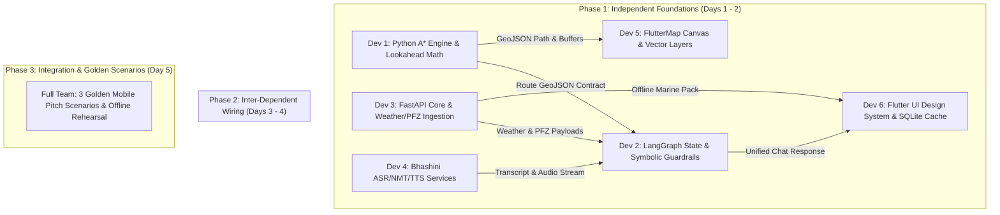

# 📅 ORCA: 5-Day Implementation Plan (6-Member Team)
> **Problem Statement ID:** 26176 (ISRO) | **Target Timeline:** 5 Days (Sprint Execution)  
> **Platform Stack:** Flutter Mobile App (iOS/Android) + FastAPI / LangGraph Multi-Agent Backend  
> **Methodology:** Independent Component Decoupling $\rightarrow$ Contract Integration $\rightarrow$ Golden Scenarios  

---

## 👥 1. Team Composition & Ownership Matrix

| Member | Title / Specialization | Core Responsibilities & Modules Owned |
| :--- | :--- | :--- |
| **Dev 1** | **Lead Geospatial & Math Engineer** | `backend/app/geospatial/`: Coastline & IMBL GIS parsing, 2D Navigable Grid, $A^*$ obstacle-avoiding marine pathfinding, Dynamic speed-drift lookahead vectors (`distance.py`, `geofence.py`, `astar.py`, `grid.py`). |
| **Dev 2** | **Multi-Agent & Guardrails Architect** | `backend/app/agents/`: LangGraph `AgentState` graph, `IntentClassifier`, Specialized worker nodes, Deterministic `SymbolicGuardrails` engine (Zero-Hallucination) (`state.py`, `graph.py`, `symbolic_verifier.py`). |
| **Dev 3** | **Data Pipeline & Backend Core Engineer** | `backend/app/services/` & `backend/app/api/`: Open-Meteo Marine API client, INCOIS/MOSDAC PFZ feed parser, FastAPI REST endpoints, Caching layer (`router.py`, `schemas.py`, `open_meteo.py`, `cache.py`). |
| **Dev 4** | **Voice & Multilingual Specialist** | `backend/app/services/bhashini.py` & `mobile/lib/data/repositories/voice_repository.dart`: Bhashini ASR, NMT, TTS integration, streaming audio endpoints, Indic language localized prompts. |
| **Dev 5** | **Flutter Mobile Map & GIS Engineer** | `mobile/lib/views/map/` & `mobile/lib/providers/marine_map_provider.dart`: FlutterMap / MapLibre Native canvas, custom nautical dark/sunlight themes, GeoJSON vector layers (IMBL, PFZ, Hazards, $A^*$ route line). |
| **Dev 6** | **Flutter UX, Offline Engine & Lead Integrator** | `mobile/lib/views/dashboard/`, `chat/`, `offline/` & `mobile/lib/data/local/`: Mobile Design System, Conversational Voice Bottom Sheet, `sqflite` pre-voyage offline sync, E2E integration wiring, 3 Golden Demo pitch scenarios. |

---

## 📊 2. Architectural Dependency Graph

To prevent integration blockers, **Days 1 and 2 focus exclusively on Independent Tasks** using mocked data contracts. **Days 3 and 4 connect Interdependent Interfaces**, and **Day 5 locks in End-to-End Golden Scenarios**.

---

## 🗓️ 3. Day-by-Day Detailed Work Breakdown

### 📍 DAY 1: Independent Domain Foundations & Mock Contracts
*Goal: Every developer builds their core module in isolation against defined schemas without waiting on teammates.*

- **Dev 1 (Geospatial & Math):**
  - Download & parse India-Sri Lanka IMBL and coastline GeoJSON polygons (`GeoPandas`, `Shapely`).
  - Implement Haversine and geodesic cross-track distance calculations in `backend/app/geospatial/distance.py`.
  - Write standalone unit tests for Point-in-Polygon and boundary proximity.
- **Dev 2 (Multi-Agent & Guardrails):**
  - Setup LangGraph structure and define `AgentState` TypedDict in `backend/app/agents/state.py`.
  - Implement rule-based/regex fallback `IntentClassifierNode` and skeleton worker nodes (`WeatherNode`, `PFZNode`, `BoundaryNode`).
  - Create mock data fixtures for all node inputs/outputs.
- **Dev 3 (Data Pipeline & FastAPI):**
  - Scaffold FastAPI project structure with CORS, Pydantic schemas, and structured logging.
  - Implement async client for Open-Meteo Marine API (`wave_height`, `wind_speed`, `swell_period`).
  - Build mock INCOIS PFZ parser outputting realistic chlorophyll and SST gradient polygons.
- **Dev 4 (Voice Pipeline):**
  - Implement Bhashini API wrapper (`backend/app/services/bhashini.py`) with fallback local mock audio generation.
  - Create WAV/PCM audio format converter utility for streaming compatibility.
  - Write automated tests verifying Tamil, Telugu, and Hindi audio transcription.
- **Dev 5 (Flutter Mobile Map):**
  - Setup Flutter project with `flutter_map` (or `maplibre_gl`).
  - Configure nautical dark theme vector tiles (CartoDB Dark Matter / OSM).
  - Build toggleable vector layer widgets for static IMBL boundary lines and warning buffer zones.
- **Dev 6 (Flutter UX & SQLite Offline):**
  - Setup Flutter design system tokens (`AppColors.dart`, typography, glassmorphic cards).
  - Scaffold Mobile Telemetry HUD bar (Speed, Heading, GPS coordinates, Border Distance).
  - Initialize `sqflite` SQLite schema for local offline storage (`cached_imbl_boundaries`, `cached_weather_grid`, `cached_pfz_advisories`).

---

### 📍 DAY 2: Algorithmic Rigor & Standalone Verification
*Goal: Complete the complex mathematical and architectural logic in each module.*

- **Dev 1 (Geospatial & Math):**
  - Build 2D water grid discretization over coastal coordinates (0.01° cell resolution).
  - Implement $A^*$ heuristic pathfinding algorithm in `backend/app/geospatial/astar.py` with obstacle rasterization for landmasses.
  - Implement 15-minute speed-drift lookahead vector calculation and intersection test in `backend/app/geospatial/geofence.py`.
- **Dev 2 (Multi-Agent & Guardrails):**
  - Implement deterministic `SymbolicGuardrailNode` in `backend/app/agents/guardrails/symbolic_verifier.py`.
  - Program non-negotiable hard rules ($d_{\text{IMBL}} < 2\text{ km}$, $H_s > 2.5\text{ m}$, $v_{\text{wind}} > 25\text{ kts}$).
  - Implement `EmergencyOverrideNode` which preempts the LLM if safety invariants fail.
- **Dev 3 (Data Pipeline & FastAPI):**
  - Build TTL-based in-memory caching layer (`cache.py`) for weather rasters and PFZ polygons.
  - Implement `/api/v1/marine/weather` and `/api/v1/marine/pfz` REST endpoints.
  - Implement `/api/v1/marine/offline-pack` endpoint bundling 24-hour bounding box data.
- **Dev 4 (Voice Pipeline):**
  - Implement NMT translation pipeline (Indic $\rightarrow$ English for LLM input, English $\rightarrow$ Indic for response).
  - Build TTS audio generation endpoint and Flutter audio streaming receiver.
  - Add audio caching for repetitive safety advisories (e.g., boundary alerts) to minimize API latency.
- **Dev 5 (Flutter Mobile Map):**
  - Implement dynamic vessel marker with live rotatable heading indicator and lookahead vector ribbon.
  - Implement interactive PFZ layer rendering chlorophyll intensity gradients with popup cards.
  - Implement animated weather risk heatmap overlay for waves $> 2.0\text{ m}$.
- **Dev 6 (Flutter UX):**
  - Build push-to-talk microphone button (`VoiceMicButton.dart`) with pulsating radar animation and haptic feedback.
  - Build conversational bottom sheet with dual-language message cards (Regional transcript + English translation tags).
  - Build Pre-Voyage Offline Packer UI modal with download progress bar.

---

### 📍 DAY 3: Inter-Dependent Module Wiring & API Contracts
*Goal: Connect independent modules into a cohesive end-to-end multi-agent pipeline.*

- **Dev 1 + Dev 2 (GIS + Agents Integration):**
  - Connect $A^*$ pathfinding engine into `RoutingAgentNode`.
  - Connect boundary distance and lookahead vector math into `BoundaryAgentNode`.
  - Verify that `SymbolicGuardrailNode` intercepts any route intersecting land or IMBL buffer.
- **Dev 3 + Dev 2 (Data + Agents Integration):**
  - Connect live Open-Meteo client into `WeatherAgentNode`.
  - Connect INCOIS PFZ parser into `PFZAgentNode`.
  - Compile the complete LangGraph `StateGraph` runnable with fallback error boundaries.
- **Dev 4 + Dev 6 (Voice + Flutter UI Integration):**
  - Wire Flutter `VoiceMicButton` to backend Bhashini `/api/v1/chat/message` audio endpoint using `dio`.
  - Implement auto-playback of incoming base64 TTS audio responses using `audioplayers`.
  - Add language selector supporting Tamil, Telugu, Hindi, Bengali, Gujarati, and English.
- **Dev 5 + Dev 1 (Map + GIS Integration):**
  - Wire `/api/v1/navigation/route` GeoJSON response directly into the Flutter `AStarRouteLayer` polyline.
  - Render dynamic animated cyan dashed lines along calculated $A^*$ waypoints.

---

### 📍 DAY 4: Edge Offline Resilience & Multi-Turn Hardening
*Goal: Polish system robustness, test edge cases, and ensure seamless mobile offline failover.*

- **Dev 1 + Dev 5 (Geofence & Alerting Hardening):**
  - Connect live device GPS stream (`geolocator`) to `/api/v1/geofence/check`.
  - Build real-time visual warning flash (Red pulse) and auditory buzzer when $d_{\text{IMBL}} < 2\text{ km}$.
- **Dev 2 + Dev 3 (Synthesis & Performance Optimization):**
  - Optimize LLM prompt templates in `ResponseSynthesizer` for concise, marine-accurate summaries.
  - Benchmark multi-agent pipeline latency; ensure parallel execution $< 1.5\text{ s}$.
- **Dev 4 + Dev 6 (Offline Caching & Mobile Client Fallback):**
  - Implement client-side SQLite hydration when user clicks "Download 24h Offline Pack".
  - Build offline mode switch: when device loses mobile data, Flutter client runs local Dart Haversine calculations against SQLite IMBL vectors and plays pre-cached emergency audio alerts.
- **Full Team:**
  - Execute end-to-end test suite across all 6 language configurations on physical Android/iOS test devices.

---

### 📍 DAY 5: Golden Pitch Scenarios & Final Polish
*Goal: Rehearse and validate the 3 Golden Demo Scenarios for the ISRO evaluation jury.*

- **Scenario 1: High-Yield PFZ Discovery & Calm Routing (Tamil Voice Query)**
  - Fisherman asks in Tamil: *"அருகிலுள்ள நல்ல மீன்பிடி மண்டலம் எங்கே?"*
  - System identifies high-chlorophyll PFZ ($14\text{ km}$ offshore), verifies safe swell ($1.1\text{ m}$), routes around shallow reef, and synthesizes Tamil spoken advisory on mobile.
- **Scenario 2: Dynamic IMBL Drift Emergency Warning & 180° Evasion**
  - Vessel simulated moving at $12\text{ knots}$ towards Sri Lankan border.
  - At $3.5\text{ km}$ distance, 15-minute lookahead vector detects imminent breach.
  - Mobile app fires flashing red emergency banner, sounds warning buzzer, and recalculates safe northward return course.
- **Scenario 3: Mid-Sea Cyclone Rerouting & High-Seas Disconnected Mode**
  - Phone switched to Airplane mode (zero cellular connectivity).
  - Vessel encounters simulated storm cell ($H_s = 2.8\text{ m}$).
  - System alerts crew using cached offline SQLite marine pack and displays safe path to nearest shelter harbor.
- **Final Pitch Artifacts:**
  - Finalize presentation deck, live mobile screen-mirroring demo script, and architectural video recordings.
